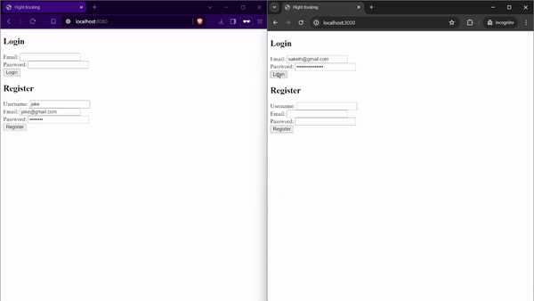

# Booking System: Solved Double Booking Problem!

I implemented this project to understand how booking systems work. There are two primary approaches to handling concurrency in booking systems:

- **Pessimistic Lock:**
  - More cautious approach.
  - Involves acquiring and releasing locks.
  - Once a user has acquired an exclusive row-level lock, other users need to wait until the lock is released.
  - Can cause performance issues due to locking overhead.
  - However, it’s a reliable approach when avoiding conflicts is critical (e.g., financial transactions).

- **Optimistic Lock:**
  - Assumes that conflicts are rare, so it avoids the overhead of locking.
  - It detects conflicts after they occur
  - Each user reads the data, performs their booking, and then checks if the seat is still available before updating it. If another user has already claimed the seat, the system handles the conflict gracefully.
  - For example, when booking a ticket on a platform like BookMyShow, the system checks if the seat is available (using an `isBooked` flag).
  - Behavior depends on the database; if the isolation level is set to read committed, and also if the database refreshes the row once someone commits the transaction then it's fine to use it.

What i choose was first option

# Demo

Check high quality demo [here](/demo/demo.mp4)

# Technical things
Database schema is available [here](/database-schema.sql).

Thunder Client is [here](/airLineThunderClient.json).

## Tech Stack
- NodeJs
- Express
- Postgres

**Incomplete Things:**
- I didn't use the username at all. If you feel it's redundant, you can make some changes and remove it.
- I forgot to create the `places` table. This could benefit you in searching for places like arrival and destination. My goal was to develop it and solve the double booking concurrency issue, so I didn't implement it.
- I didn't include validations for dates (before and after). I didn't check if the user is trying to book a flight before the current date.

All these issues are easily solvable!

# Conclusion
- While both pessimistic and optimistic locking have their trade-offs
- choosing the right approach depends on your system’s requirements and expected load.